<div align="center">

# Seed2Store

**Certified crops, traded direct.**<br/>
A marketplace where growers list harvest lots with a tamper-evident certificate of origin and sell straight to buyers through buy-now, private offers or open auctions, settled on-chain when you want it.

<a href="docs/media/seed2store-walkthrough.mp4"></a>

▶ **[Watch the 75-second walkthrough](docs/media/seed2store-walkthrough.mp4)** · 📘 **[Read the full guide (PDF)](docs/Seed2Store-Guide.pdf)**

</div>

---

## Contents

1. [What it is](#what-it-is)
2. [Features](#features)
3. [Screens](#screens)
4. [Quick start](#quick-start)
5. [End-to-end walkthrough](#end-to-end-walkthrough)
6. [How it works](#how-it-works)
7. [MongoDB](#mongodb)
8. [Blockchain](#blockchain)
9. [API reference](#api-reference)
10. [Configuration](#configuration)
11. [Testing](#testing)
12. [Deploying](#deploying)
13. [Security model](#security-model)
14. [Troubleshooting](#troubleshooting)
15. [Project layout](#project-layout)

---

## What it is

Grain, coffee and produce still trade mostly through phone calls, middlemen and paper slips. Origin data, quality grades and fair prices get lost at every hand-off. Seed2Store keeps the record with the lot:

- **Growers** register a lot (crop, variety, origin, harvest date, grade, moisture, photos). The provenance fields are fingerprinted with **keccak-256** the moment they're saved, and can be minted as an **ERC-721 certificate**.
- **Buyers** see exactly where, when and how it was grown, then buy outright, negotiate privately, or bid in an open auction.
- **Anyone downstream** can paste a serial like `S2S-695D-EB66` and verify that the record hasn't changed since it was certified, and who holds the token today.

It runs with **zero configuration** (a seeded demo market, a burner wallet, local storage) and scales up to **MongoDB** plus a real chain by setting a few environment variables.

---

## Features

| Growers | Buyers | Anyone |
|---|---|---|
| Four-step listing with a live certificate preview | Market search across title, variety, origin and grower; crop chips, organic filter, sort | Verify a certificate by serial, token ID, lot ID or hash |
| Drag-and-drop photos (GridFS or IPFS) | Live auctions with countdown, quick-bid chips and reserve status | Recomputes the fingerprint and reads the token from the chain |
| One-click mint to an ERC-721 certificate | Buy-now with an escrowed on-chain purchase | Public ERC-721 metadata endpoint |
| Auctions with reserve, duration and anti-sniping | Private offers with a note | |
| Offer inbox: accept (opens an order) or decline with a reply | My bids: leading, outbid, won, lost | |
| Orders: confirm payment, then ship | Orders: pay, then confirm delivery | |
| Dashboard: revenue chart, sales by crop, to-do queue | Dashboard: spend chart, active bids, to-do queue | |

**Blockchain visibility (every interaction is inspectable):**
- **On-chain ledger** (`/chain`): every certificate mint, auction, bid, sale and ERC-721 transfer, decoded from the contract's events, with value, tx hash, block and age, plus contract stats (minted, volume, fees held).
- **Transaction inspector** (`/chain/tx/:hash`): status, block, from/to, gas used, gas price, fee, the decoded function call and every event emitted, with an Etherscan link.
- **NFT page** (`/token/:id`): the certificate NFT with current owner, issuer, `tokenURI`, its IPFS metadata JSON, the on-chain struct, and its full ownership history.
- **My certificates** (`/certificates`): NFTs in your wallet and the ones you issued.
- **Live transaction tracker**: every write shows *Sign in wallet → Broadcast → Mined in block N (gas, fee) → Recorded in MongoDB*, with the decoded call arguments.

Also: real-time notifications (outbid, new bid, offer, sold, shipped, delivered), signed-message sign-in with any EIP-6963 wallet or a burner wallet, two themes (**Harvest Noir** dark and **Field Paper** light), and generative field artwork for lots without photos.

---

## Screens

| | |
|---|---|
| 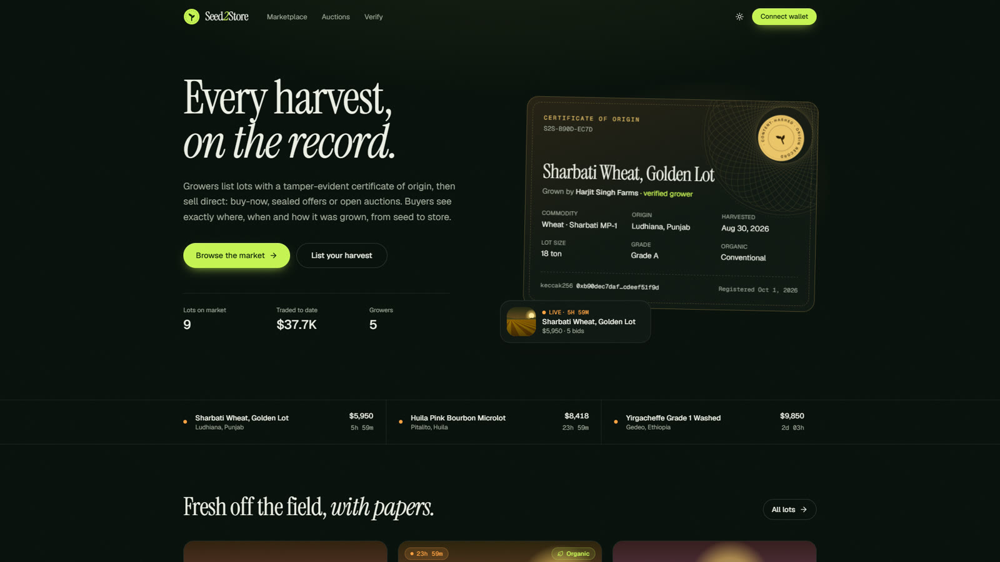 **Landing.** Live auctions and a real certificate. | 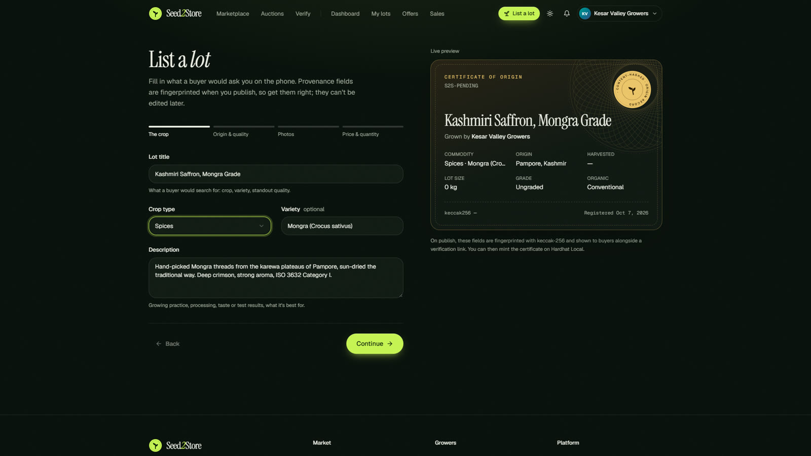 **List a lot.** The certificate fills in as you type. |
| 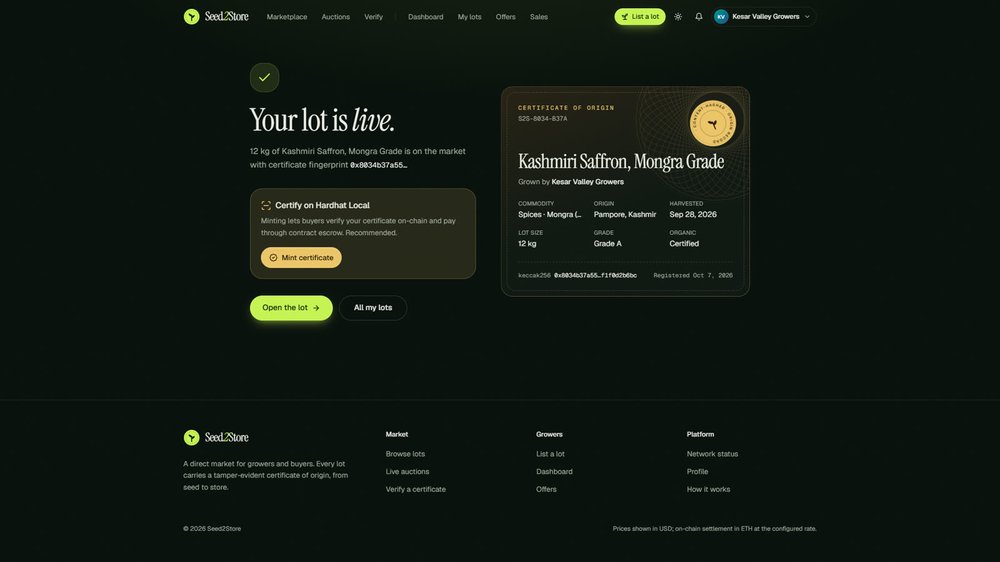 **Published.** Fingerprinted and sealed, ready to mint. | 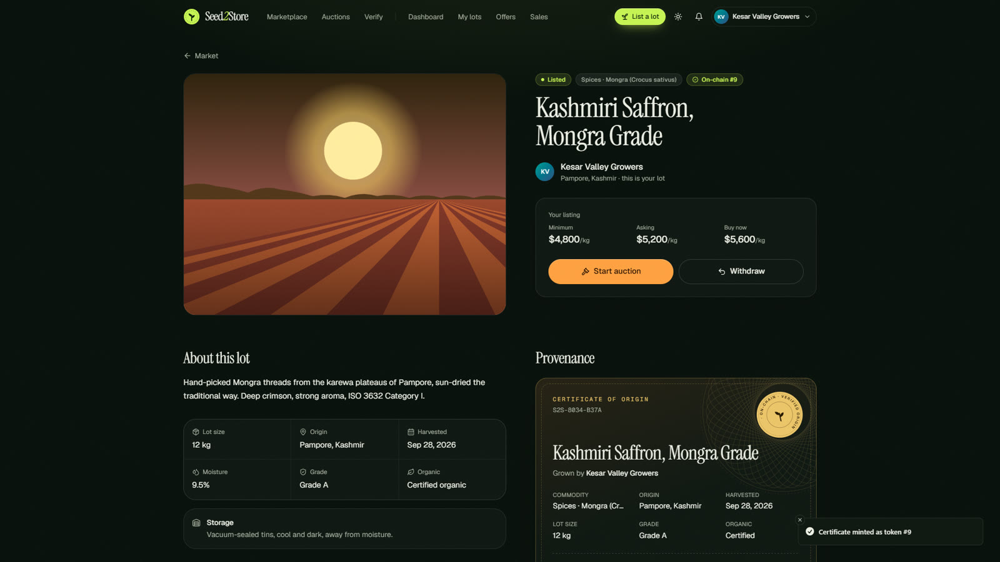 **Minted.** The lot is certified on-chain. |
| 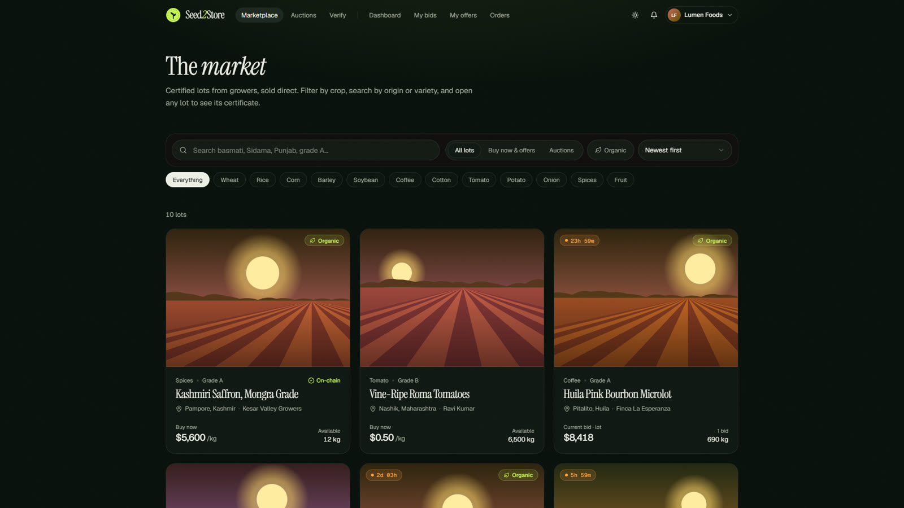 **The market.** Certified lots with origin, grade and price. | 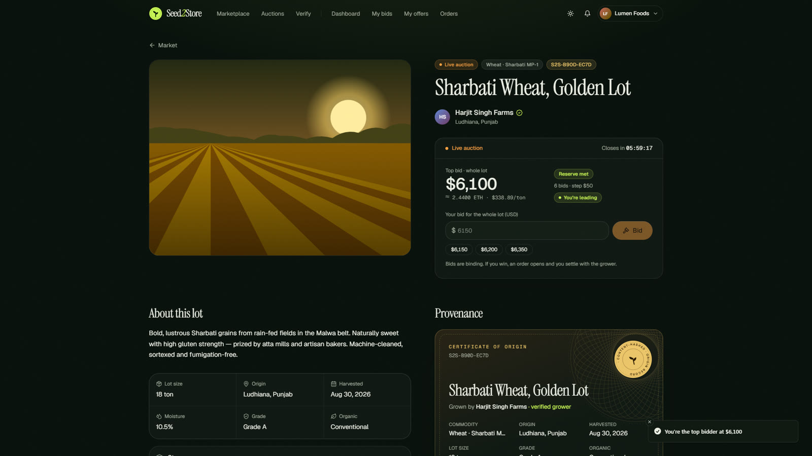 **Live auction.** Anti-sniping bids. |
| 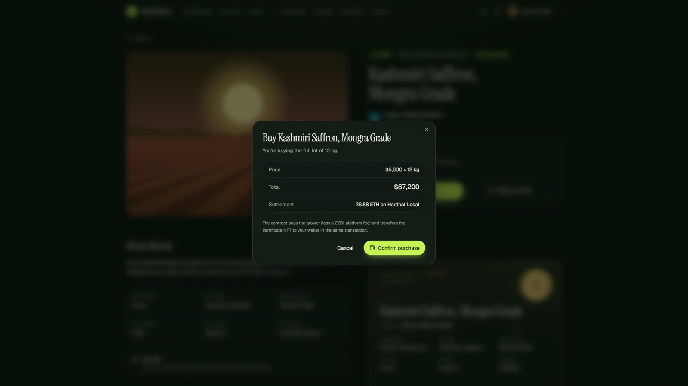 **Buy now.** Escrowed on-chain purchase. | 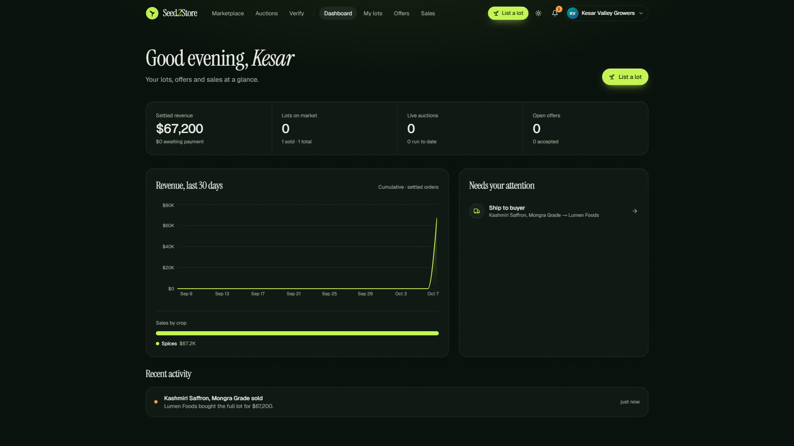 **Grower dashboard.** Revenue, tasks and activity. |
| 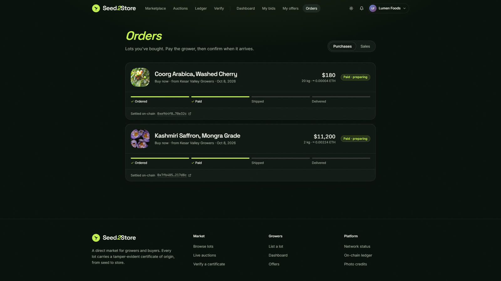 **Orders.** Payment, then shipping, then delivery. | 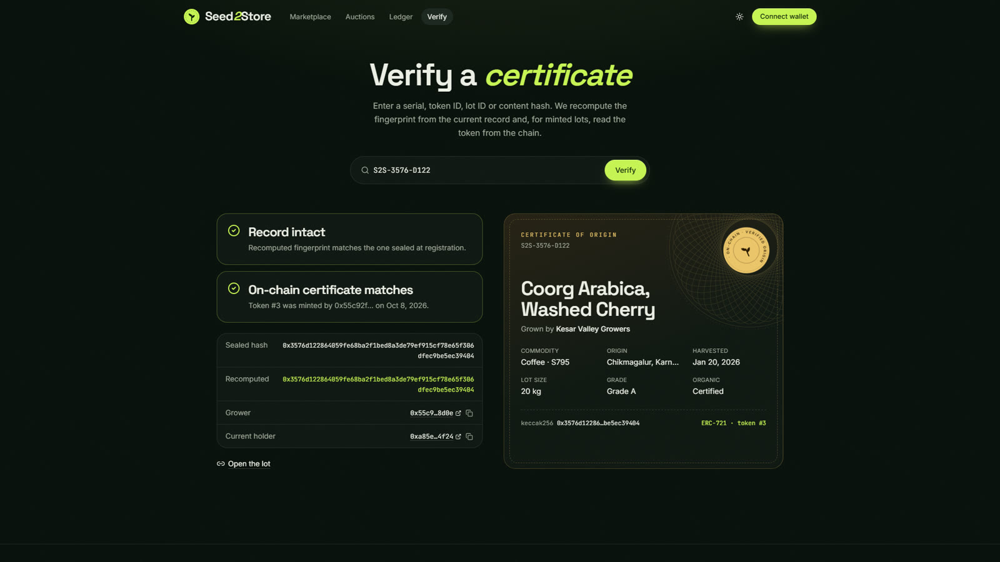 **Verify.** Record intact; on-chain certificate matches. |

---

## Quick start

**Requirements:** Node.js 20+ (22 recommended). MongoDB and a local chain are optional.

```bash
npm install
npm run dev
```

Open http://localhost:3000, click **Connect wallet → Burner wallet**, and you're in a seeded market with growers, lots, three live auctions, offers and order history. Switch between **Buyer** and **Farmer** mode from the account menu.

### Add MongoDB (recommended)

```bash
# .env.local
MONGODB_URI=mongodb://127.0.0.1:27017
MONGODB_DB=seed2store
```

Restart `npm run dev`. Collections and indexes are created on first start, and an empty database is seeded with the demo market.

### Turn on the blockchain

```bash
npm run chain          # terminal 1: Hardhat node on :8545 (chain 31337)
npm run deploy:local   # terminal 2: deploys Seed2StoreNFT and writes .env.local
npm run dev            # restart to pick up the contract address
```

The burner wallet funds itself on local chains, so the whole on-chain flow works without MetaMask. `/status` shows exactly what the running app is connected to.

---

## End-to-end walkthrough

This is the exact flow shown in the video. It runs entirely locally.

**1. Sign in as a grower.** Click **Connect wallet → Burner wallet** (or MetaMask). You sign a free message, with no transaction and no gas. Then switch to **Farmer** in the account menu and add a name under **Profile**.

**2. List a lot.** Go to **List a lot** and fill in four steps:
- *The crop:* title, type, variety, description.
- *Origin & quality:* location, harvest date, grade, moisture, organic.
- *Photos:* optional. Lots without photos get a generated field illustration.
- *Price & quantity:* minimum, asking and buy-now price per unit.

The certificate preview on the right fills in live. **Publish** seals it: the provenance fields are hashed and the lot is on the market with a serial like `S2S-8034-B37A`.

**3. Mint the certificate** (blockchain enabled). On the success screen or the lot page, click **Mint certificate**. The lot gets an **On-chain #N** badge, and its `tokenURI` points to the lot's metadata.

**4. Sign in as a buyer.** In a second browser profile, connect a different wallet and stay in **Buyer** mode. Browse **Marketplace**, filter by crop, open a lot.

**5. Bid, offer or buy.**
- *Auction:* type a bid ≥ the minimum (or tap a quick-bid chip). On-chain auctions escrow your ETH in the contract and refund you automatically if you're outbid. A bid in the last 10 minutes extends the auction by 10 minutes.
- *Offer:* propose a quantity and price with a note. The grower can accept (an order opens and the quantity is reserved) or decline.
- *Buy now:* confirm the dialog. For a certified lot this is one `directPurchase` transaction: the grower is paid (minus a 2.5% platform fee) and the NFT moves to you.

**6. Fulfil the order.** The grower sees it under **Sales**: **Payment received** (automatic for on-chain purchases), then **Mark shipped**. The buyer clicks **Confirm delivery**. Both sides get notified at every step, and dashboards update.

**7. Auctions settle themselves.** When an auction ends above its reserve, an order opens for the winner. On-chain auctions show a **Settle on-chain** button that calls `finalizeAuction` to pay the grower and transfer the NFT, or to refund the bidder if the reserve wasn't met.

**8. Verify.** Anyone (no wallet needed) can open **Verify**, paste the serial, token ID or hash, and see:
- **Record intact:** the fingerprint recomputed from the live record matches the sealed one.
- **On-chain certificate matches:** the token's issuer is the grower, plus who holds it now.

---

## How it works

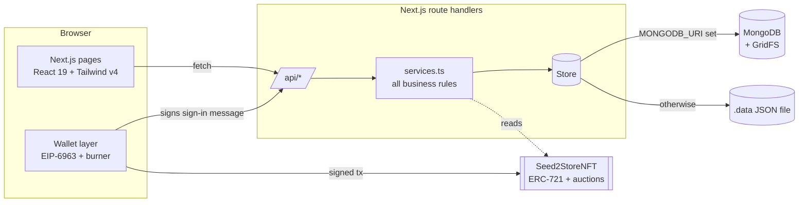

- **One rules engine.** Every business rule lives in `lib/server/services.ts` and runs identically on both storage backends. Route handlers in `app/api` stay thin: authenticate, parse, call a service.
- **Atomic state changes.** Anything two people could race on (buy-now, bids, accepting an offer, settling an auction, order transitions) uses a compare-and-set `updateIf` (a MongoDB `findOneAndUpdate` with the expected state in the filter). Exactly one request wins; the other gets a clear `409`.
- **Chain first, then record.** When a lot is certified on-chain, the wallet transaction happens first and the API records its hash. The API refuses off-chain shortcuts for certified lots (partial offers, off-chain buys, off-chain auctions).
- **Lazy housekeeping.** Expired auctions are settled and stale offers expired on read, so there's no cron to run.
- **Provenance hash.** `keccak256(canonicalJSON(fields))` over the immutable fields only (title, description, crop, variety, unit, harvest date, origin, organic, grade, moisture, storage, photos, grower wallet, registration time). Quantity and prices legitimately change as a lot trades, so they're excluded. The serial is `S2S-` plus the first 8 hex digits.

### The buy flow, on-chain

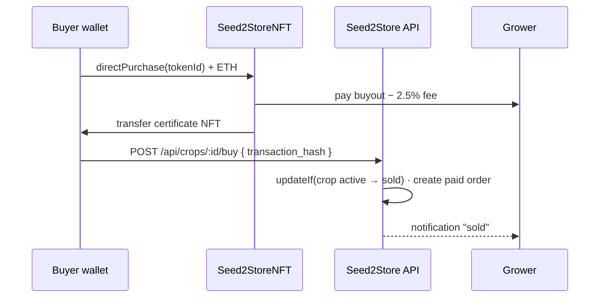

---

## MongoDB

| Collection | Contents | Indexes |
|---|---|---|
| `users` | wallet, role, display name, location, bio | `wallet_address` (unique), `role` |
| `crops` | lots: provenance, prices, status, `content_hash`, NFT linkage | `status+created_at`, `farmer_id`, `content_hash`, `nft_token_id` |
| `auctions` | price ladder state, end time, reserve, on-chain ID, winner | `status+end_time`, `crop_id` |
| `bids` | every bid with optional tx hash | `auction_id+amount`, `bidder_id` |
| `offers` | quantity, price, message, reply, status | `crop_id+status`, `buyer_id` |
| `orders` | source (buy-now / offer / auction), payment and delivery status | `buyer_id`, `farmer_id`, `created_at` |
| `notifications` | per-user activity feed with deep links | `user_id+created_at` |
| `uploads.files` / `uploads.chunks` | lot photos in GridFS, content-addressed by SHA-256 | |
| `meta` | the generated session secret (when `AUTH_SECRET` isn't set) | |

- Documents use the domain ID (UUID) as `_id`; timestamps are ISO-8601 strings.
- Works with a local server or **MongoDB Atlas** (`mongodb+srv://…`).
- `MONGODB_SEED=false` starts with an empty market. `npm run db:reset` drops the database (photos included) so the next start re-seeds.

---

## Blockchain

**Contract:** `contracts/Seed2StoreNFT.sol` is an ERC-721 called "Seed2Store Certificate" (`S2SC`), built on OpenZeppelin 4.9.

| Function | What it does |
|---|---|
| `createCropCertificate(…)` | Mints a certificate to the grower, storing key fields plus the metadata URI. |
| `createAuction(tokenId, start, reserve, increment, duration)` | Opens an auction (1 hour to 30 days). |
| `placeBid(auctionId)` *payable* | Escrows the bid and refunds the previous leader; the last 10 minutes extend the end. |
| `finalizeAuction(auctionId)` | Pays the grower and transfers the NFT, or refunds if the reserve wasn't met (the lot can be relisted). |
| `directPurchase(tokenId)` *payable* | Pays the grower minus the fee, transfers the NFT, refunds overpayment. Blocked while an auction is live. |
| `getCropCertificate`, `getAuction`, `ownerOf`, `tokenURI` | Reads used by the app and the verify page. |

**Networks:** `npm run deploy:local` (Hardhat, 31337), `npm run deploy:ganache` (7545, 1337) or `npm run deploy:sepolia`. Each writes `deployments/<network>.json` and updates `.env.local` (contract, chain, RPC, deploy block).

### Deploying to Sepolia

1. Put a testnet-only key in `.env.local` as `DEPLOYER_PRIVATE_KEY`, and fund its address with ~0.05 Sepolia ETH from a faucet (Google Cloud, Alchemy or Infura).
2. Run `npm run deploy:sepolia`. It deploys, records the deploy block, sets the Etherscan explorer, switches to a testnet price rate (`NEXT_PUBLIC_ETH_USD=5000000`, so a $67,200 lot costs ~0.013 test-ETH), and verifies the source on Sourcify (and on Etherscan if `ETHERSCAN_API_KEY` is set).
3. Restart `npm run dev`. Use **MetaMask on Sepolia** (or a burner wallet you fund from a faucet) for growers and buyers.

**Pricing:** listings are in USD. On-chain values are converted at `NEXT_PUBLIC_ETH_USD` (default 2500 USD per ETH). Bids always send at least the contract's own minimum, so rounding can never make a valid bid revert.

**Metadata:** OpenSea-compatible JSON at `/api/metadata/:id`, or pinned to IPFS when `PINATA_JWT` is set.

---

## API reference

All routes are under `/api`. Writes require a session (sign-in below); reads of public market data don't.

| Method | Route | Purpose |
|---|---|---|
| GET | `/auth/nonce?address=` | Get the sign-in message to sign |
| POST | `/auth/verify` | `{ address, signature }`: start a session (HMAC cookie, 7 days) |
| GET | `/auth/me` | Current user or `null` |
| POST | `/auth/logout` | End the session |
| PATCH | `/me` | Update role, display name, location, bio |
| GET | `/crops` | Market search: `q, crop_type, organic, min_price, max_price, status, sort, page, limit` |
| POST | `/crops` | Register a lot (farmer) |
| GET | `/crops/mine` | Your lots (farmer) |
| GET / PATCH | `/crops/:id` | Lot detail · `{ action: "delist" \| "relist" }` |
| POST | `/crops/:id/mint` | Record a mint `{ token_id, transaction_hash }` |
| POST | `/crops/:id/buy` | Buy now `{ transaction_hash? }` |
| GET | `/crops/:id/offers` | Offers on a lot (grower sees all, buyer sees own) |
| GET / POST | `/auctions` | List (`?status=active\|ended`) · create |
| GET / DELETE | `/auctions/:id` | Auction + bids · cancel (no bids, off-chain only) |
| POST | `/auctions/:id/bids` | Place a bid `{ amount, transaction_hash? }` |
| POST | `/auctions/:id/finalize` | Record an on-chain settlement |
| GET | `/bids` | Your bids with standing |
| GET / POST | `/offers` | Received (`?type=received`) or sent · make an offer |
| PATCH | `/offers/:id` | `{ action: "accept" \| "reject" \| "withdraw", message? }` |
| GET | `/orders?as=buyer\|farmer` | Your purchases or sales |
| PATCH | `/orders/:id` | `{ action: "confirm_payment" \| "ship" \| "deliver" \| "cancel" }` |
| GET / PATCH | `/notifications` | Feed · mark read `{ ids? }` |
| GET | `/stats` · `/stats/market` | Your dashboard stats · market totals |
| POST · GET | `/uploads` · `/uploads/:file` | Upload a photo · serve it |
| GET | `/metadata/:id` | ERC-721 token metadata |
| GET | `/chain/summary` · `/chain/events?token=` | Contract stats · decoded event ledger |
| GET | `/chain/tx/:hash` · `/chain/token/:id` | Decoded transaction · NFT detail with metadata and history |
| GET | `/chain/owned?address=` · `/chain/balance?address=` | Certificates held and issued · wallet balance |
| GET | `/verify?q=` | Verify by serial, token ID, lot ID or hash |
| GET | `/status` | Database, chain, storage and session status |

Errors come back as `{ "error": "Human-readable message" }` with `400`, `401`, `403`, `404` or `409`.

---

## Configuration

Copy `.env.example` to `.env.local`. Everything is optional.

| Variable | Default | Purpose |
|---|---|---|
| `MONGODB_URI` | — | Use MongoDB (otherwise the local JSON file) |
| `MONGODB_DB` | `seed2store` | Database name |
| `MONGODB_SEED` | `true` | Seed an empty database with the demo market |
| `NEXT_PUBLIC_NFT_CONTRACT` | — | Enables on-chain certificates, auctions and purchase |
| `NEXT_PUBLIC_CHAIN_ID` | `31337` | Chain ID (Hardhat 31337, Ganache 1337, Sepolia 11155111) |
| `NEXT_PUBLIC_RPC_URL` | `http://127.0.0.1:8545` | RPC used by the burner wallet and server reads |
| `NEXT_PUBLIC_CHAIN_NAME` / `NEXT_PUBLIC_EXPLORER_URL` | derived | Labels and explorer links |
| `NEXT_PUBLIC_ETH_USD` | `2500` | USD per ETH for on-chain prices |
| `RPC_URL` | — | Server-only RPC override |
| `PINATA_JWT` / `PINATA_GATEWAY` | — | Pin lot photos and NFT metadata (`tokenURI` = `ipfs://…`) to IPFS via Pinata |
| `NEXT_PUBLIC_DEPLOY_BLOCK` | `0` | First block the explorer scans (written by the deploy script) |
| `DEPLOYER_PRIVATE_KEY` / `ETHERSCAN_API_KEY` | — | Sepolia deployment and optional Etherscan verification |
| `AUTH_SECRET` | auto-generated | Session signing key (stored in the database if unset) |
| `PRIVATE_KEY`, `SEPOLIA_RPC_URL`, `GANACHE_RPC_URL` | — | Contract deployment |

---

## Testing

```bash
npm test          # Vitest
npm run typecheck # tsc --noEmit
npm run build     # production build (type-checked)
```

The service suite runs **twice**, against the local store and against a real MongoDB (`MONGODB_TEST_URI`, default `mongodb://127.0.0.1:27017`, skipped if unreachable), in a throwaway database. It covers:
- registration validation and tamper detection
- offers that turn into orders
- buy-now and the full order lifecycle
- auction increments, outbid notifications and settlement
- simultaneous buy-nows and bids, where exactly one must win
- GridFS round-trips
- regressions for timezone bugs, which pass in any timezone

---

## Deploying

**Vercel + MongoDB Atlas** is the simplest production setup:

1. Create an Atlas cluster and set `MONGODB_URI` and `MONGODB_DB`.
2. Set `AUTH_SECRET` (any long random string).
3. Optionally deploy the contract to Sepolia (`npm run deploy:sepolia`) and set `NEXT_PUBLIC_NFT_CONTRACT`, `NEXT_PUBLIC_CHAIN_ID=11155111`, `NEXT_PUBLIC_RPC_URL` and `NEXT_PUBLIC_EXPLORER_URL`.
4. Optionally set `PINATA_JWT` for IPFS.

The local JSON fallback needs a writable disk, so always set `MONGODB_URI` on serverless hosts.

---

## Security model

- **Authentication:** sign-in with a signed message (nonce in a signed, short-lived cookie; signature recovered with `ethers.verifyMessage`). The session is a stateless HMAC-SHA256 cookie (`httpOnly`, `sameSite=lax`, `secure` in production).
- **Authorization:** every write checks the session user server-side (owner checks for lots, auctions and offers; party checks for orders). Client-supplied wallet addresses are never trusted.
- **Integrity:** compare-and-set on every racy transition; a unique wallet index; certified lots can't be split or settled off-chain.
- **Uploads:** image types only, 8 MB cap, content-addressed names; the file route rejects anything that isn't `sha256.ext`, so there's no path traversal.
- **Contract:** `nonReentrant` on value transfers; refunds on outbid and failed auctions; direct purchase is blocked during live auctions.

---

## Troubleshooting

| Symptom | Fix |
|---|---|
| `npm install` fails with peer-dependency errors | The repo's `.npmrc` sets `legacy-peer-deps`; make sure it's present |
| `/status` shows MongoDB unreachable | Check `MONGODB_URI`, and that `mongod` or Atlas network access allows your IP |
| "No contract code at …" | The Hardhat node restarted (state is in-memory). Run `npm run deploy:local` again and restart `npm run dev` |
| MetaMask "nonce too high" after a chain restart | MetaMask → Settings → Advanced → Clear activity tab data |
| Sign-in loops after changing `AUTH_SECRET` | Expected: old sessions are invalidated. Connect again |
| Demo data looks stale (auctions ended) | `npm run db:reset`, then restart. Seed times are relative to now |

---

## Project layout

```
app/                 pages and /api route handlers
components/          UI: certificate, crop art, lot/*, header, shadcn/ui primitives
contracts/           Seed2StoreNFT.sol
lib/server/          store (MongoDB | JSON), services (business rules), session, chain, ipfs, seed
lib/wallet/          wallet provider (EIP-6963 + burner), contract and lot-action hooks
lib/                 shared types, config, formatting, certificate hashing, crop catalog
scripts/             deploy.js, reset-local-db.js
test/                Vitest suites (services on both backends, date validation)
docs/                guide PDF, walkthrough video, screenshots, legacy docs
```

Built with Next.js 16, React 19, Tailwind CSS v4 (Space Grotesk, Inter, JetBrains Mono), MongoDB Atlas, Pinata/IPFS, ethers v6, Solidity 0.8.19 and Hardhat.
